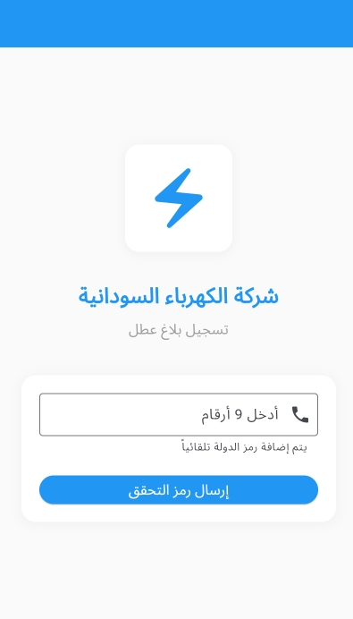

# 📱 Flutter App - نظام تسجيل بلاغات الأعطال  

تطبيق أندرويد لتسجيل بلاغات الأعطال باستخدام **تعلم الآلة** لصالح الشركة السودانية لتوزيع الكهرباء.  
يتيح للمستخدمين إرسال بلاغات الأعطال بسهولة، كما يوفر لوحة تحكم لعرض وتحليل البيانات.  

---

## ✨ المميزات
- تسجيل بلاغات الأعطال مع تفاصيل الموقع والوصف.
- رفع صور مرفقة مع البلاغ.
- تصنيف الأعطال باستخدام خوارزميات تعلم الآلة.
- واجهة سهلة الاستخدام **(UI/UX)**.
- تخزين البيانات باستخدام **SQLite / MySQL**.
- مزامنة البيانات مع الخادم (API).  

---

## 🛠️ التقنيات المستخدمة
- **Flutter & Dart**  
- **Machine Learning (Python Model Integration)**  
- **SQLite / MySQL**  
- **REST API**  
- **Git & GitHub**  

---

## 🚀 التشغيل محليًا
1. استنسخ المستودع:
   ```bash
   git clone https://github.com/username/flutter-debt-app.git
   cd flutter-debt-app
   
2.ثبت الحزم
flutter pub get

3.شغل التطبيق:
flutter run


